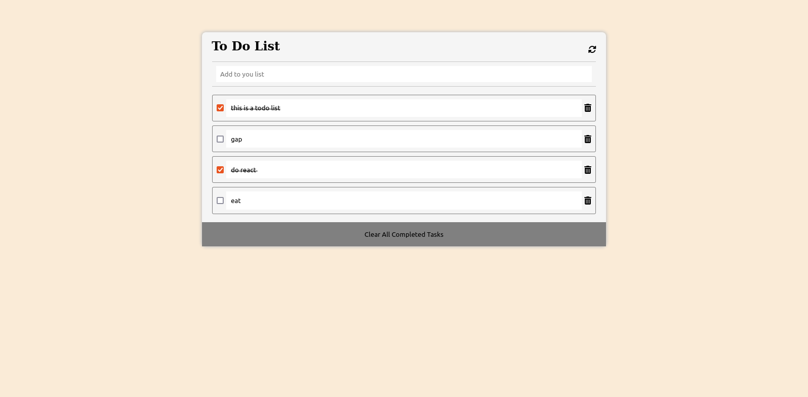

# To do list

> this project helps you keep track of your task.  it helps you arrange your tasks in oder of most urgent and then when you compleate your task you check it as done and finally you can delete all the completed tasks.

## see the live version of the project at:

-todo list [Todo list](https://businesskaniki.github.io/todo-list/dist/)


## Built With

- html 
- css
- javascript
- webpack


## To get started with this project run the following command


```
git clone https://github.com/businesskaniki/todo-list

```
## change to that directorate and open the project on your editor


## Authors

👤 **Author1**

- GitHub: [@githubhandle](https://github.com/businesskaniki)
- Twitter: [@twitterhandle](https://twitter.com/kaniki7346)
- LinkedIn: [LinkedIn](https://linkedin.com/in/nicholasmaina)


## 🤝 Contributing

Contributions, issues, and feature requests are welcome!

Feel free to check the [issues page]( https://github.com/businesskaniki/todo-list/issues/).

## Show your support

Give a ⭐️ if you like this project!

## Acknowledgments

- Hat tip to anyone whose code was used
- Inspiration
- etc

## 📝 License

This project is [MIT](./MIT.md) licensed.
